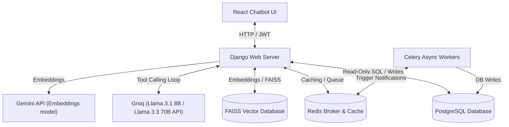

# Task Manager API & AI Chatbot

A production-style Task Management System built with **Django REST Framework (DRF)** and integrated with a **React-based AI Chatbot Assistant** dashboard. It features role-based workflows, team-scoped security boundaries, async notification tasks (Celery + Redis), PostgreSQL integration, RAG document search, and SQL database tool calling.

This project simulates a real-world enterprise workflow where Admins, Managers, Developers, and QA members collaborate through projects, tasks, and an interactive AI assistant.

---

# 🏗️ System Architecture



---

# 🤖 AI Chatbot Assistant

The chatbot serves as an intelligent project planner, database query tool, and workflow coordinator. It is accessible securely through the client UI dashboard.

### 🌟 Key Capabilities
*   **Idempotency & Database Safety**: Protects the database from duplicate projects or tasks. The creation tools (`create_project_tool`, `create_task_tool`) scan the database first; if a project or task with the same name already exists in the scope, they return the existing record ID instead of creating duplicates.
*   **Sequential Batch Action Flow**: The agent can handle compound instructions in a single turn. For example, you can request: *"Create a new project named 'Task Management Platform' for team alpha, and in it create tasks 1, 2, and 3."* The backend executes the project creation first, then links and creates all the tasks in a single confirmation turn.
*   **Scoped SELECT Queries**: Team boundaries are strictly enforced. Developers and QAs can only query and view database columns/rows related to their own team projects or tasks assigned directly to them. Raw SQL writes, updates, or DDL commands are prohibited.
*   **RAG (Retrieval-Augmented Generation)**: If documents (`.pdf`, `.docx`, `.txt`, `.md`) are uploaded in a session, the chatbot automatically indexes them using an in-memory **FAISS vector store**. The agent can query these documents to retrieve specifications and automatically propose/execute tasks based on the retrieved context.
*   **Secure Backend Parameter Injection**: Confidential context parameters like `user_id` and `session_id` are stripped from LLM-facing schemas and injected on the backend by the server. This prevents validation errors and prevents the model from hallucinating or omitting user credentials.
*   **Double Confirmation Requirement**: All write actions (creating projects, tasks, or assigning assignees) require explicit user confirmation (e.g. replying "yes" or "confirm") before execution.
*   **Conversational Fallback**: If the tool calling loop ends on a tool execution message, the backend automatically performs a fallback conversational completion, ensuring the user always receives a friendly text summary and never raw JSON.

---

# 🚀 Core Features

### 🔐 Authentication & User Management
*   JWT Authentication (Access & Refresh tokens)
*   Custom User Model using `AbstractUser`
*   Role-based user permissions:
    *   **Admin**: Total system control, user and team management, cross-team task assignment, reporting.
    *   **Manager**: Project CRUD, task CRUD, team workflow management.
    *   **Developer**: Create tasks, update task states, access assigned tasks. Barred from deleting tasks or creating projects.
    *   **QA**: Review tasks, update task states. Barred from creating projects or tasks.
*   Admin-controlled user creation (Public registration is disabled). Users change password on initial login.

### 🔔 Notification System
*   Async notification system using **Celery** + **Redis**.
*   Triggered automatically on task assignments or assignee changes.
*   Supports manual message exchange between team members.
*   Mark notifications as read/unread endpoints.

### 👥 Team Management
*   Team creation and member scoping.
*   Enforces business rules: Max one Manager and one QA per team.
*   Team-based project ownership and access controls.

### 📁 Project Management
*   Project CRUD APIs with start/end date trackers.
*   Support for Active / Inactive projects. Normal team members cannot view tasks belonging to inactive projects.
*   Redis caching for project list endpoints.

### ✅ Task Management
*   Task CRUD APIs with priority toggles and due dates.
*   Workflow states: *Draft, In Progress, In Review, Completed, Blocked, Cancelled*.
*   Admin users are excluded from task assignments.
*   Supports robust filtering by state, priority, assignee (`/tasks/?assigned_to_me=true`), and deadline ranges.

---

# 🛠️ Tech Stack

*   **Backend Framework**: Python / Django / Django REST Framework (DRF)
*   **Frontend Dashboard**: React (Vite) / Vanilla CSS / Lucide Icons
*   **Database**: PostgreSQL 16
*   **Caching & Broker**: Redis 7
*   **Background Tasks**: Celery
*   **AI Service**: Groq SDK (`llama-3.3-70b-versatile` & `llama-3.1-8b-instant`) / Gemini API (`gemini-3.5-flash`)
*   **Containerization**: Docker & Docker Compose

---

# 🏗️ Project Structure

```text
TASK_MANAGER_API/
│
├── accounts/          # User authentication and custom profile views
├── config/            # Django base configuration and urls
├── chatbot/           # Chatbot API, FAISS index, and SQL tools agent
├── notifications/     # Celery asynchronous notifications module
├── projects/          # Projects models and serializers
├── tasks/             # Tasks models, serializers, and permission logic
├── teams/             # Teams models and serializers
│
├── chatbot_ui/        # React (Vite) Chatbot Frontend Dashboard
│   ├── src/
│   │   ├── components/
│   │   │   ├── Login.jsx
│   │   │   ├── Sidebar.jsx
│   │   │   ├── ChatArea.jsx
│   │   │   └── Markdown.jsx
│   │   ├── App.jsx
│   │   └── index.css
│   └── package.json
│
├── .env               # Environment variable configuration file
├── docker-compose.yml # Docker multi-container services definition
├── Dockerfile         # Docker recipe for Django API container
├── manage.py
├── README.md
└── requirements.txt
```

---

# ⚙️ Setup & Installation Instructions

Follow these steps to run the complete stack (Django Backend, PostgreSQL, Redis, Celery, and React Chatbot UI).

### Prerequisites
*   [Docker and Docker Compose](https://docs.docker.com/get-docker/) installed.
*   [Node.js (v18+) and npm](https://nodejs.org/) installed (for local frontend development).

### 1. Environment Configuration
Create a `.env` file in the root directory:
```env
DB_NAME=task_manager
DB_USER=postgres
DB_PASSWORD=postgres
DB_HOST=db
DB_PORT=5432

SECRET_KEY=your_django_secret_key_here
DEBUG=True

# AI Assistant API Keys (Required for chatbot functionality)
GEMINI_API_KEY=your_gemini_api_key_here
GROQ_API_KEY=your_groq_api_key_here
```

### 2. Running Services with Docker Compose
From the root directory, spin up the backend containers (Django web app, PostgreSQL, Redis, Celery worker):
```bash
docker compose up --build
```

### 3. Database Initial Setup (Migrations & Superuser)
With the containers running, open a new terminal and run database migrations:
```bash
docker compose exec web python manage.py migrate
```

Create an Admin Superuser:
```bash
docker compose exec web python manage.py createsuperuser
```

Seed initial teams, roles, users, projects, and tasks data:
```bash
docker compose exec web python manage.py seed_data
```

### 4. Running the Chatbot UI Frontend
Open a separate terminal window and navigate to the frontend directory:
```bash
cd chatbot_ui
```

Install dependencies:
```bash
npm install
```

Start the Vite development server:
```bash
npm run dev
```
The client dashboard will be available at `http://localhost:5173/`. 
*Note: Vite is preconfigured to proxy `/api` endpoints to the backend container running at `http://localhost:8000/`.*

---

# 🔑 Core API Endpoints

### Authentication
*   `POST /api/users/login/` - Returns JWT Access & Refresh tokens.
*   `POST /api/users/token/refresh/` - Refreshes expired Access token.
*   `GET /api/users/profile/` - Fetch profile details.
*   `PATCH /api/users/profile/change-password/` - Update profile password.

### Chatbot Engine
*   `GET /api/chatbot/sessions/` - List active user chat sessions.
*   `POST /api/chatbot/sessions/` - Create a new chat session.
*   `DELETE /api/chatbot/sessions/<uuid>/` - Deletes a chat session.
*   `POST /api/chatbot/sessions/<uuid>/message/` - Send a message to the agent.
*   `POST /api/chatbot/sessions/<uuid>/attachments/` - Upload PDF/DOCX/TXT/MD files to index.

### Tasks & Projects
*   `GET/POST /api/projects/` - Manage team projects.
*   `GET/POST /api/tasks/` - Manage tasks (supports `?assigned_to_me=true`, `?state=in_review`, etc.).
*   `GET /api/tasks/reports/overdue/` - Raw SQL report of overdue tasks (Admin only).

---

# 🚀 Future Roadmap
*   Email notifications on Celery scheduler.
*   WebSockets integration for real-time notification alerts.
*   Task comment streams and attachment uploads.
*   Full activity audit log history.

---

# 📄 License

This project is for educational and pair-programming practice purposes.

---

# 👨‍💻 Author

Khushi Koriya  
GitHub: [https://github.com/khushiiik](https://github.com/khushiiik)